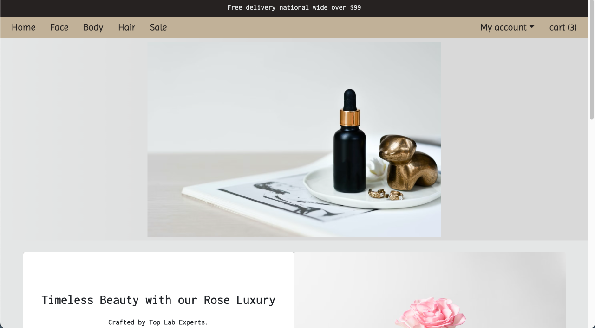
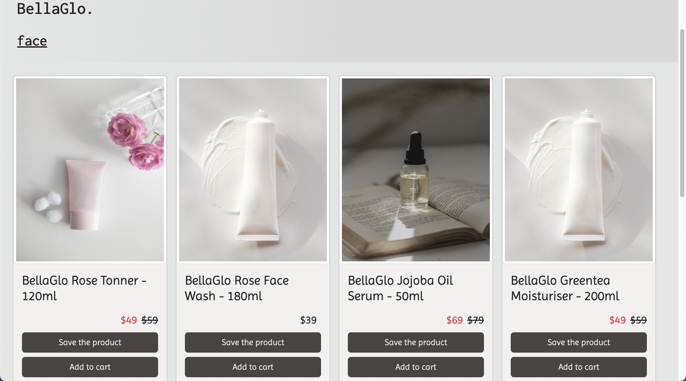
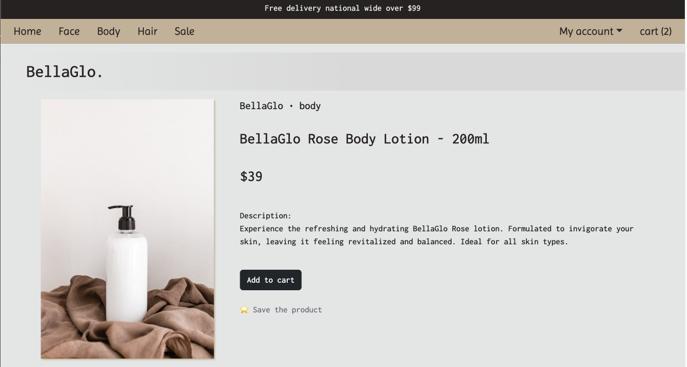
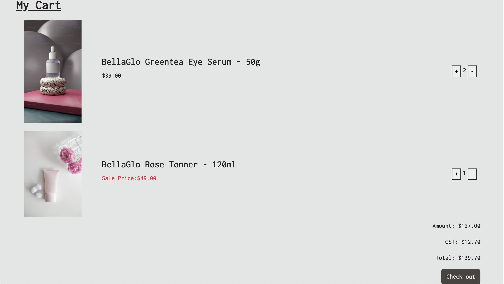
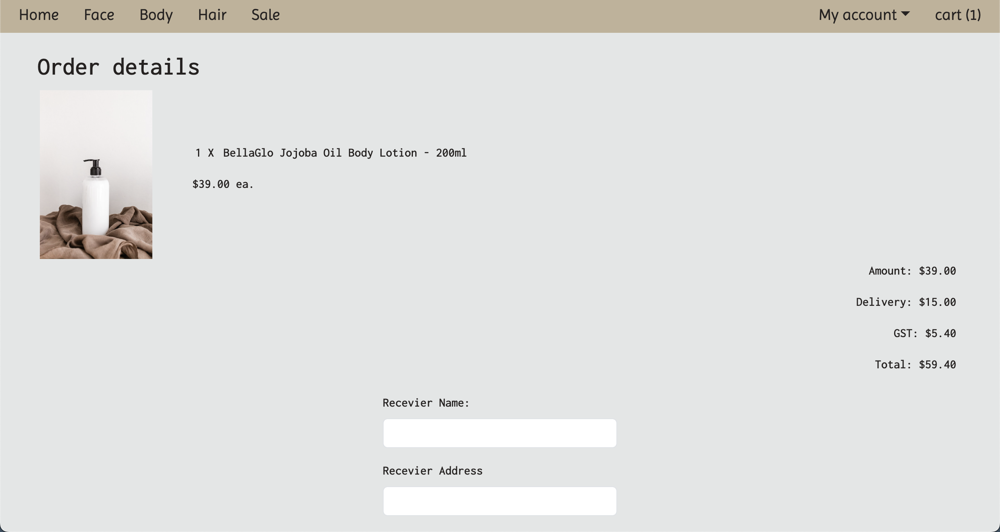
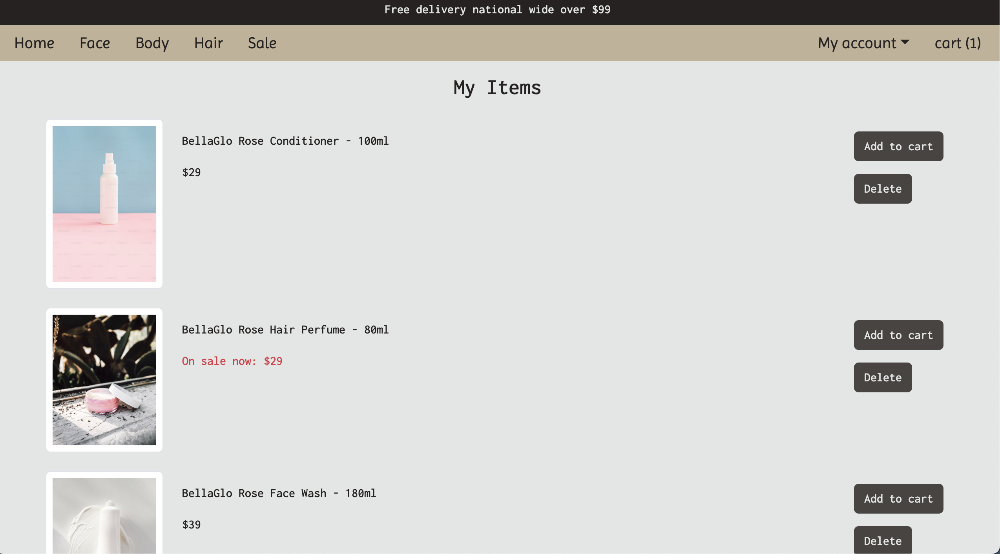

# BellaGlo (skincare e-commerce)

### **Technologies used**

---

- Responsive Web Design
- Node Express framework
- React vite framework
- Back End: Typescript , PostgreSQL , Prisma(ORM)
- Front End: HTML, SCSS/CSS, Bootstrap, Stripe and Clerk

### **App screenshot**

---

